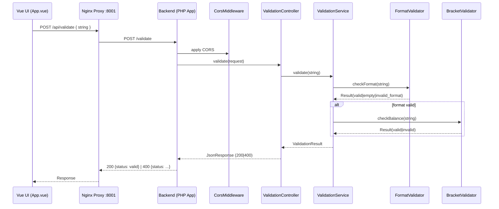
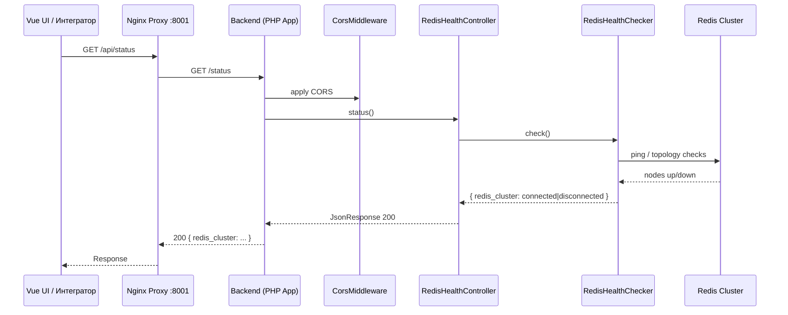
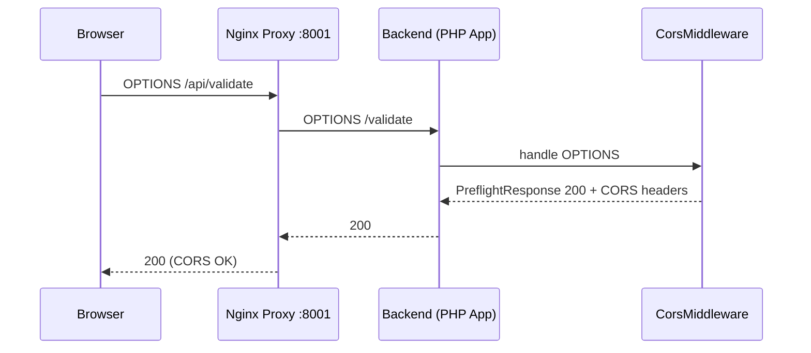
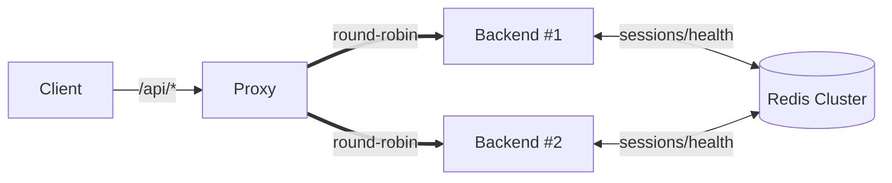

# ▶️ Control Flow — Маршруты бизнес‑процессов (последовательности вызовов)

Версия: 1.0  
Дата: 2025‑08‑14

Документ описывает контрольные (управляющие) потоки для ключевых сценариев учебного мини‑проекта «Валидация скобок». В проекте нет аутентификации, БД и платежей — контрольные маршруты ограничены MVP‑функциями: проверка строки и health Redis.

См. также:
- docs/overview/architecture.md — high‑level обзор
- docs/overview/user-flow.md — пользовательские сценарии
- docs/architecture/data-flow.md — движение данных
- docs/architecture/backend-architecture.md — слои и жизненный цикл HTTP
- docs/architecture/frontend-architecture.md — устройство UI
- docs/architecture/api-spec.md — спецификация эндпоинтов

---

## 1) Сценарий: Проверка строки со скобками (UI → API)

Цель: пользователь вводит строку, жмёт «Проверить», получает статус: `valid | invalid | empty | invalid_format`.

Компоненты и вызовы (пошагово):
1. UI (frontend/src/App.vue)
   - Обработчик submit() формирует POST запрос `POST /api/validate` с JSON `{ string: "..." }` через Axios.
2. Nginx Proxy (:8001)
   - Принимает внешний `POST /api/validate`, удаляет префикс `/api`, проксирует на backend → `POST /validate` (round‑robin между двумя backend‑инстансами без sticky‑sessions).
3. Backend: public/index.php → App → Router
   - Создание приложения, регистрация маршрутов и middleware, диспатч контроллера для `POST /validate`.
4. Middleware: App\Http\Middleware\CorsMiddleware
   - Добавляет CORS‑заголовки к ответу (для POST); OPTIONS обрабатывается отдельно (см. сценарий 3).
5. Controller: App\Controllers\ValidationController::validate
   - Парсит JSON, проверяет наличие и тип поля `string` (ошибка запроса → 400 `{ error.message }`).
   - Вызывает Application Service: `App\Services\ValidationService::validate(string)`.
6. Application Service: App\Services\ValidationService
   - Оркестрирует доменные валидаторы в строгой последовательности:
     6.1. App\Validator\FormatValidator::checkFormat(string)
       - trim; проверка пустоты (→ `empty`), допустимых символов только `(` и `)`, длины ≤ 30 (нарушение → `invalid_format`).
     6.2. Если формат валиден → App\Validator\BracketValidator::checkBalance(string)
       - Однопроходный алгоритм; возвращает `valid` или `invalid`.
   - Возвращает DTO App\Models\ValidationResult c финальным статусом.
7. Controller
   - Преобразует ValidationResult в HTTP‐ответ JsonResponse: `200 {status: valid}` или `400 {status: invalid|empty|invalid_format}`.
8. Response
   - Через App\Http\ResponseSender отправляется клиенту; Proxy проксирует ответ назад в UI.
9. UI
   - Отображает человекочитаемое сообщение и цветовую индикацию статуса.

Диаграмма (sequence):

Пограничные ветки управления:
- Ошибка запроса (нет `string` или тип не строка): контроллер формирует `400 { error: { message } }` и завершает поток, валидаторы не вызываются.
- Исключение на сервере: `App\Core\ExceptionHandler` возвращает `500 { error.message: "Internal Server Error" }`.
- Сессии PHP хранятся в Redis Cluster, но на поток валидации не влияют (нет зависимости бизнес‑логики от сессии).

---

## 2) Сценарий: Проверка статуса Redis Cluster (UI/оператор → API)

Цель: получить `connected | disconnected` для отображения инфраструктурного статуса.

Компоненты и вызовы (пошагово):
1. UI (App.vue)
   - Таймер onMounted запускает периодические вызовы `GET /api/status` (первая проверка через ~2с, далее ~каждые 30с).
2. Nginx Proxy (:8001)
   - Принимает `GET /api/status`, удаляет `/api`, проксирует на backend → `GET /status` (round‑robin).
3. Backend: Router → RedisHealthController::status
   - Middleware CORS добавляет заголовки.
   - Контроллер вызывает App\Redis\Health\RedisHealthChecker::check().
4. RedisHealthChecker
   - Опрашивает список узлов кластера (config/redis.php), считает количество доступных, сравнивает с порогом кворума.
   - Возвращает объект/массив со статусом `connected | disconnected`.
5. Controller → JsonResponse
   - Всегда `200 OK` с `{ redis_cluster: ... }`.
6. Ответ проксируется в UI.

Диаграмма (sequence):

Примечания по управлению потоком:
- Даже при `disconnected` возвращается `200 OK`; это диагностический эндпоинт.
- Ошибки сети к RC обрабатываются внутри health‑чекера и транслируются в `disconnected`.

---

## 3) Сценарий: CORS Preflight (OPTIONS /api/*)

Цель: предоставить браузеру разрешения CORS до фактического запроса.

Компоненты и вызовы (пошагово):
1. Браузер посылает `OPTIONS /api/...` (например, перед POST /api/validate).
2. Nginx Proxy проксирует на backend → `OPTIONS /...` (без `/api`).
3. Backend: Router → CorsMiddleware
   - Для метода `OPTIONS` middleware немедленно формирует `PreflightResponse 200` с заголовками:
     - `Access-Control-Allow-Methods: GET, POST, OPTIONS`
     - `Access-Control-Allow-Headers: Content-Type, Authorization`
4. Ответ отсылается без вызова контроллеров.

Диаграмма (sequence):

---

## 4) Балансировка и маршрутизация backend (инфраструктурный контрольный поток)

Контрольные шаги, невидимые клиенту, но влияющие на поток:
- Proxy (nginx/proxy) держит upstream из двух backend Nginx + PHP‑FPM контейнеров и распределяет запросы round‑robin.
- Префикс `/api` удаляется на прокси, поэтому внутренние маршруты регистрируются как `/validate`, `/status`.
- Sticky‑sessions не используются. Сессии PHP хранятся в Redis Cluster, поэтому смена backend не ломает сессию HTTP.

Диаграмма (flow):

---

## 5) Ошибки и ветвления управления (обобщение)

- Ошибка запроса (неверный JSON / нет поля `string` / тип не строка):
  - Место обнаружения: ValidationController
  - Ответ: `400 { error: { message: "Поле \"string\" обязательно и должно быть строкой" } }`
  - Поток: контроллер завершает без вызова доменных валидаторов
- Доменные статусы (валидация):
  - Место определения: ValidationService + валидаторы
  - Ответы: `200 {status: valid}` или `400 {status: invalid|empty|invalid_format}`
- Серверные исключения:
  - Место перехвата: App\Core\ExceptionHandler
  - Ответ: `500 { error: { message: "Internal Server Error" } }`
- Redis статус:
  - Всегда `200`, значение в поле `redis_cluster`

---

## 6) Соответствие реализациям и ограничения scope

- Эндпоинты и классы соответствуют: 
  - `POST /validate` → `App\Controllers\ValidationController::validate`
  - `GET /status` → `App\Controllers\RedisHealthController::status`
  - Слои: Controllers → Services → Validators/Models; Middleware: `CorsMiddleware`; инфраструктура: `RedisHealthChecker`.
- Вне области (не отражается в контрольных потоках):
  - Регистрация/логин, подписки/платежи, админ‑панель, БД и история проверок, расширенная наблюдаемость.

---

## 7) Быстрые ссылки

- API: /api/validate (POST), /api/status (GET), OPTIONS /api/* (preflight)
- Код: src/Controllers, src/Services, src/Validator, src/Http, src/Core, src/Redis
- Инфраструктура: nginx/proxy, nginx/backend, docker‑compose.*.yml, config/redis.php, php/conf.d/session.redis.ini
