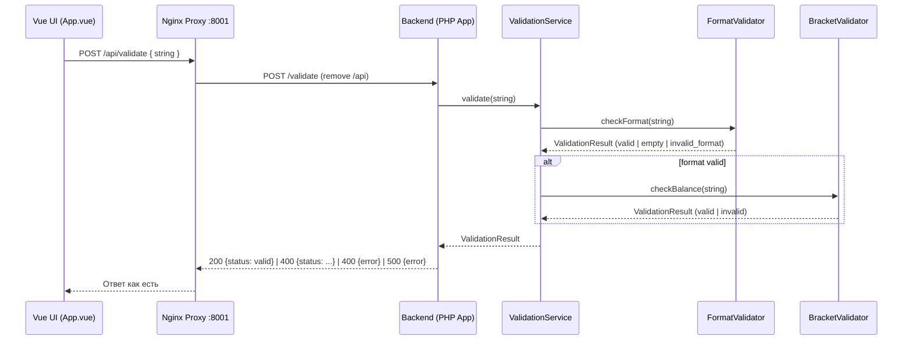
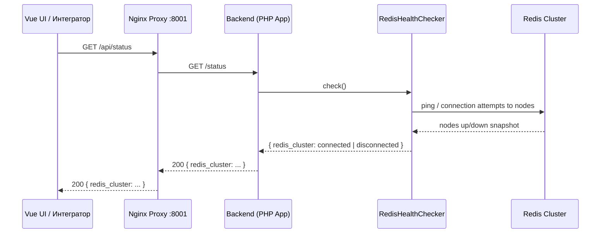
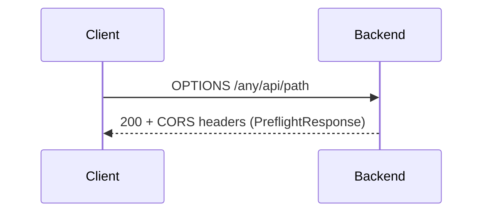
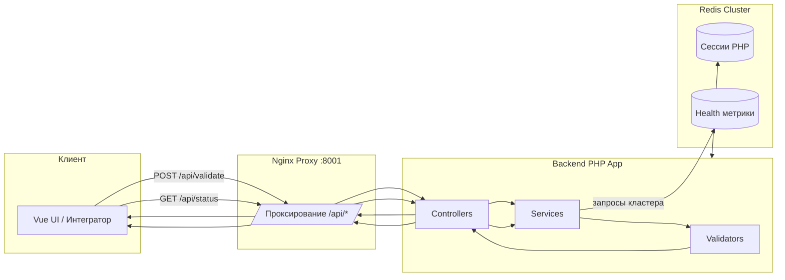

# 🔄 Data Flow — Движение данных (Frontend → Backend → Redis → Ответ)

Версия: 1.0  
Дата: 2025‑08‑14

Документ описывает фактическое движение данных в учебном мини‑проекте «Валидация скобок», от фронтенда до backend и обратно. Важное уточнение: В ПРОЕКТЕ НЕТ БАЗЫ ДАННЫХ. Единственное состояние хранится в Redis Cluster для PHP‑сессий и используется для health‑проверок. Валидация строки — чистая вычислительная операция без персистентного хранения.

Смотри также:
- docs/overview/architecture.md — High‑Level обзор и схема компонентов
- docs/architecture/backend-architecture.md — слои и жизненный цикл HTTP
- docs/architecture/frontend-architecture.md — устройство Vue UI и вызовы API
- docs/architecture/api-spec.md — спецификация эндпоинтов и форматы

---

## 1) Компоненты и каналы данных

- Клиент (Браузер с Vue UI) — отправляет HTTP запросы через Nginx proxy на `/api/*`.
- Nginx Proxy (порт 8001) — проксирует `/api/*` к backend, удаляет префикс `/api`.
- Backend (PHP‑FPM + Nginx) — Router → Controllers → Services → Validators → DTO → JsonResponse.
- Redis Cluster —
  - Хранение PHP‑сессий (`session.save_handler=rediscluster`).
  - Источник инфраструктурной метрики (health) для эндпоинта `/status`.

Отсутствует: БД (PostgreSQL/MySQL и т.п.), кэширование результатов валидации — не реализовано в текущем MVP.

---

## 2) Поток данных: POST /api/validate

Задача: принять JSON `{"string": "..."}`, выполнить валидацию формата и баланса скобок и вернуть статус `valid | invalid | empty | invalid_format`.



Пошагово:
1. UI (App.vue) формирует `POST /api/validate` с `Content-Type: application/json` и телом `{ string: "..." }`.
2. Proxy снимает префикс `/api` → `POST /validate` к backend.
3. ValidationController:
   - Парсит JSON; проверяет наличие поля `string` и что это строка. Ошибки запроса → `400 { error.message }`.
   - Вызывает `ValidationService::validate(string)`.
4. ValidationService orchestration:
   - `FormatValidator` применяет `trim`, проверяет:
     - пустая строка → `status=empty` (400)
     - допустимые символы: только `(` и `)` → иначе `invalid_format` (400)
     - длина строки ≤ 30 → иначе `invalid_format` (400)
   - Если формат валиден → `BracketValidator` выполняет односканерную проверку баланса:
     - сбалансировано → `valid` (200)
     - несбалансировано → `invalid` (400)
5. Контроллер преобразует `ValidationResult` в `JsonResponse` с соответствующим HTTP‑кодом и отправляет через `ResponseSender`.

Данные, которые проходят через систему:
- Вход: поле `string` (строка в UTF‑8), ограничение длины ≤ 30 символов.
- Выход: `{ "status": "valid|invalid|empty|invalid_format" }` или `{ "error": { "message": "..." } }`.
- Персистентность: отсутствует. Результат не сохраняется; сессии клиента не используются для бизнес‑логики.

Ошибки и обработка:
- Неверный JSON, отсутствие или неверный тип поля `string` → `400 { error.message }` (см. ExceptionHandler/Controller).
- Непредвиденная ошибка сервера → `500 { error.message: "Internal Server Error" }`.

---

## 3) Поток данных: GET /api/status (Health Redis)

Задача: вернуть текущее состояние доступности Redis Cluster для информационных целей UI/оператора.



Пошагово:
1. UI вызывает `GET /api/status` (периодически, каждые ~30с; первая проверка с задержкой ~2с).
2. Proxy проксирует на `GET /status` без `/api`.
3. `RedisHealthController` вызывает `RedisHealthChecker`.
4. HealthChecker опрашивает конфигурированные узлы (см. `config/redis.php`) и вычисляет состояние по порогу кворума.
5. Возвращается `200 OK` всегда, поле `redis_cluster` — `connected` или `disconnected`.

Персистентность/кэш:
- Статус не кэшируется приложением. Возврат — «свежее» вычисленное состояние.
- Хранилище Redis при этом само по себе — источник истины и одновременно место хранения сессий PHP (см. ниже).

---

## 4) CORS и Preflight (OPTIONS /api/*)

- Все запросы проходят через `CorsMiddleware`.
- Для методов `OPTIONS` — немедленный ответ `200` с заголовками `Access-Control-Allow-Methods: GET, POST, OPTIONS` и `Access-Control-Allow-Headers: Content-Type, Authorization`.
- Для `GET/POST` — те же CORS‑заголовки добавляются к обычному `JsonResponse`.



---

## 5) Валидация: слои и ответственность

- Input‑валидация (HTTP уровень):
  - Проверка `Content-Type: application/json` (клиентская рекомендация), разбор тела запроса.
  - Наличие поля `string` и тип `string` (ошибка запроса → `400 { error.message }`).
- Доменная валидация (Application/Domain уровень):
  - `FormatValidator`: trim, ограничение длины, допустимые символы, пустота.
  - `BracketValidator`: односканерный баланс.
- DTO результата: `App\Models\ValidationResult` (иммутабельный, статические конструкторы статусов, значения: `valid`, `invalid`, `empty`, `invalid_format`).

Границы ошибок:
- Ошибка запроса (структура/тип) — `400 { error.message }`.
- Доменная ошибка — `400 { status: ... }`.
- Успех — `200 { status: valid }`.

---

## 6) Redis: сессии и «кэширование» в контексте проекта

Роль Redis в этом проекте двоякая:
1) Хранение PHP‑сессий
- В PHP задано `session.save_handler=rediscluster` и `session.save_path` с seed‑узлами кластера и префиксом, например `prefix=otus_hw04:` (см. php/conf.d/session.redis.ini).
- Ключи сессий имеют вид: `otus_hw04:session:{session_id}` (конкретный формат зависит от ini; здесь дано как типовой пример).
- TTL/GC управляются конфигурацией PHP/Redis согласно переменным окружения.
- Сессии не используются бизнес‑логикой валидации; это техническое состояние уровня HTTP.

2) Инфраструктурный health (эндпоинт `/status`)
- Приложение обращается к Redis для оценки доступности узлов.
- Данные статуса не кэшируются, а вычисляются на каждый запрос.

Что НЕ реализовано (но потенциально возможно):
- Кэширование результатов валидации (cache‑aside) по ключу хеша входной строки, например:
  - Ключ: `brval:v1:{sha1(string)}`
  - Значение: `{ status: ..., computed_at: ... }`, TTL: 60–300 сек.
  - Политика: сначала попытка `GET`, при промахе — вычисление и `SETEX`.
- В текущем MVP это не нужно, так как операция очень дешёвая; добавление кэша усложнит систему без ощутимой пользы.

---

## 7) Схемы данных (контракты)

- Запрос `/api/validate`:
```json
{
  "$schema": "https://json-schema.org/draft/2020-12/schema",
  "type": "object",
  "required": ["string"],
  "properties": {
    "string": { "type": "string" }
  },
  "additionalProperties": false
}
```

- Ответы `/api/validate` (успех и доменные ошибки):
```json
{
  "$schema": "https://json-schema.org/draft/2020-12/schema",
  "type": "object",
  "properties": { "status": { "enum": ["valid", "invalid", "empty", "invalid_format"] } },
  "required": ["status"],
  "additionalProperties": false
}
```

- Ошибки запроса/сервера:
```json
{
  "$schema": "https://json-schema.org/draft/2020-12/schema",
  "type": "object",
  "properties": {
    "error": {
      "type": "object",
      "properties": { "message": { "type": "string" } },
      "required": ["message"],
      "additionalProperties": true
    }
  },
  "required": ["error"],
  "additionalProperties": true
}
```

- Ответ `/api/status`:
```json
{
  "$schema": "https://json-schema.org/draft/2020-12/schema",
  "type": "object",
  "properties": { "redis_cluster": { "enum": ["connected", "disconnected"] } },
  "required": ["redis_cluster"],
  "additionalProperties": false
}
```

---

## 8) Безопасность и ограничения

- CORS: `GET, POST, OPTIONS`; заголовки: `Content-Type, Authorization`. Preflight всегда `200`.
- Валидация входных данных на стороне сервера исключает XSS/инъекции (данные не попадают в SQL, т.к. БД отсутствует; ограничения символов защищают от сложных сценариев).
- Ограничения: длина строки ≤ 30, доп. символы запрещены.
- Нет аутентификации/авторизации и, следовательно, нет персональных данных.

---

## 9) Диаграмма потока (объединённая)



---

## 10) Наблюдаемость и ошибки

- Централизованный `ExceptionHandler` формирует предсказуемые JSON‑ответы для 400/500.
- Логи контейнеров доступны через make‑команды (`make dev-logs`, `make prod-logs`).
- Тесты (Unit/Integration) покрывают ключевые ветки доменной логики и HTTP маршрутизацию (`make test-coverage`).

---

## 11) Выводы и рамки

- Движение данных линейно и прозрачно: UI/клиент → Proxy → Backend → (внутренние слои) → ответ.
- Персистентное хранилище (БД) отсутствует. Redis используется только для сессий и health‑проверок; кэширование результатов валидации не реализовано.
- Документ синхронизирован с текущими файлами: README.md, backend-architecture.md, frontend-architecture.md, api-spec.md и overview/architecture.md.
