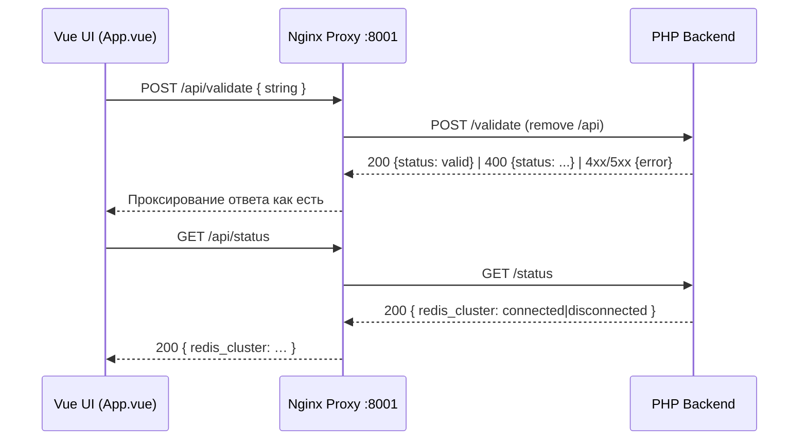

# 🎛️ Frontend Architecture — Техническая детализация (Vue 3 + Vite)

Версия: 1.0
Дата: 2025‑08‑14

Документ описывает архитектуру фронтенд‑части учебного мини‑проекта «Валидация скобок». Синхронизировано с README.md, docs/overview/* и backend‑architecture.md. Объём строго в рамках текущего MVP: без роутера, без Pinia, без i18n и дизайн‑системы.

## 1) Назначение и контекст

- Цель UI: дать простой интерфейс для отправки строки со скобками в API и отображения результата; показывать инфраструктурный статус Redis Cluster.
- Интеграция: UI работает за Nginx proxy (внешний порт 8001) и обращается к API по относительному пути `/api/*`, который проксируется к backend.
- Dev/Prod:
  - Dev: доступен Vite dev server (5173) для удобной разработки. Рекомендуется открывать UI через proxy http://localhost:8001 — так гарантировано работают API‑вызовы на `/api/*` без отдельной настройки Vite proxy.
  - Prod: собранный фронтенд отдаётся через proxy (root `/`), API проксируется на `/api/*`.

## 2) Технологический стек

- Vue 3 (Composition API)
- Vite 7
- Axios 1.11 (HTTP клиент)
- CSS: локальные стили внутри SFC (scoped)

## 3) Структура каталогов (frontend/)

```
frontend/
├── package.json
├── node_modules/
└── src/
    ├── main.js                 # Точка входа: createApp(App).mount('#app')
    ├── App.vue                 # Корневой компонент, вся логика UI MVP
    └── utils/
        └── bracketGenerator.js # Утилиты генерации скобочных строк (валидных/невалидных)
```

Примечания:
- В рамках MVP отсутствуют Router/Pinia/компонентные модули — всё сосредоточено в App.vue для простоты.
- Расширение на модули/состояние описано в разделе «Возможные улучшения».

## 4) Корневой компонент App.vue

Задачи:
- Ввод строки вручную или генерация случайной строки (валидной/невалидной) через утилиту utils/bracketGenerator.
- Отправка POST /api/validate и вывод статуса (valid | invalid | empty | invalid_format) с понятным текстом и цветовой индикацией.
- Периодическая проверка статуса Redis Cluster через GET /api/status и индикация Connected/Disconnected/Backend Unavailable.

Состояние (Composition API, локальные refs):
- manualString: введённая/сгенерированная строка
- result: текстовый результат последней проверки (для человека)
- redisStatus: «Loading…» | connected | disconnected | backend_unavailable
- isRedisStatusLoading: индикатор первичной загрузки статуса

Вычисляемые свойства (computed):
- answerClass: CSS‑класс для окрашивания результата проверки
- redisStatusClass: CSS‑класс для статуса Redis (correct/loading/incorrect/backend-error)
- redisStatusText: отображаемый текст статуса (Connected/Disconnected/…)

Жизненный цикл:
- onMounted: запуск отложенного (2s) первого запроса статуса Redis и интервала (30s) для последующих запросов
- onUnmounted: очистка интервала

Обработка событий:
- generate(): генерирует строку и сбрасывает текст результата.
- submit(): отправляет POST /api/validate; различает:
  - 200 + {status: 'valid'} → «Корректная строка! 200 OK»
  - 400 + {status: 'invalid'|'empty'|'invalid_format'} → разные сообщения
  - 4xx/5xx + {error: {message}} → сообщения об ошибке запроса/сервера
  - Отсутствие ответа (network) → «Ошибка сети или сервер недоступен»

UI/Стили:
- Небольшой адаптивный контейнер, простые кнопки/поля ввода, цветовая дифференциация статусов; анимация «пульса» для состояний Loading и Backend Unavailable у индикатора Redis.

## 5) Утилиты: utils/bracketGenerator.js

- generateValidBracketString(maxLength=20): создаёт корректную строку из пар скобок, гарантируя баланс.
- generateInvalidBracketString(maxLength=20): создаёт случайную (необязательно корректную) последовательность.
- generateRandomBracketString(): с вероятностью 50% выбирает валидный или невалидный вариант.

Назначение: ускорение ручной проверки без ручного набора строк.

## 6) Взаимодействие с API и ошибки

Эндпоинты (через proxy):
- POST /api/validate → {status: valid|invalid|empty|invalid_format} или {error: {message}}
- GET  /api/status → {redis_cluster: connected|disconnected}

Axios вызовы в App.vue:
- axios.post('/api/validate', { string: manualString.value })
- axios.get('/api/status')

Стратегия обработки ошибок:
- Business ошибки (400) — поле data.status (invalid, empty, invalid_format) → человекочитаемые сообщения.
- Request/Parse errors (400) — data.error.message (например, неверный JSON или отсутствие поля string).
- Server errors (>=500) — data.error.message → «Ошибка сервера …». 
- Network errors — «Ошибка сети или сервер недоступен» и логирование в консоль.

CORS:
- Решается на backend через CorsMiddleware (GET/POST/OPTIONS). Preflight OPTIONS возвращает 200; клиенту ничего специально делать не нужно.

Dev доступ:
- Для корректной работы относительного пути '/api' рекомендуется открывать UI по адресу http://localhost:8001 (через Nginx proxy). Прямой доступ к Vite (http://localhost:5173) без настройки Vite proxy может не проксировать /api на backend.

## 7) Переменные окружения и конфигурация

- В рамках фронтенда базовая конфигурация минимальна, отдельного vite.config.js нет.
- Базовый URL для API задан относительным путём '/api' — это позволяет единообразно работать в prod и dev при открытии UI через proxy.
- Переменные окружения всего проекта находятся в `env/.env.*` и используются преимущественно backend и инфраструктурой.

## 8) Сборка, запуск и деплой

- Dev: `make dev-build` поднимает proxy, два backend, Redis Cluster и фронтенд. UI доступен на http://localhost:8001 (рекомендуемый путь). Vite dev server также доступен на http://localhost:5173 для разработки интерфейса, однако API вызовы по '/api' через него без прокси‑настройки могут не работать.
- Prod: `make prod-up` собирает фронтенд и отдаёт его через proxy (root '/'), API доступно по '/api/*'.

Скрипты npm (frontend/package.json):
- `npm run dev` — vite
- `npm run build` — vite build
- `npm run preview` — vite preview

## 9) Тестирование фронтенда

В текущем MVP компонентных/E2E тестов нет. Проверка осуществляется manual QA + бэкенд‑тесты (unit/integration) обеспечивают корректные ответы API. Рекомендовано в дорожной карте (см. docs/overview/architecture.md):
- E2E (Playwright/Vitest) на сценарии: ввод строки → кнопка Проверить → визуальная индикация статуса; отказоустойчивость при падении backend.
- Компонентные тесты для App.vue (разбор веток ошибок, отображение классов/текстов).

## 10) Безопасность и доступность (A11y)

- Базовая безопасность обеспечивается CORS и строгой обработкой JSON на backend.
- A11y: семантические элементы, контрастные цвета для статусов, понятные тексты сообщений. В рамках MVP не добавлялись ARIA‑атрибуты и клавиатурная навигация — возможные улучшения.

## 11) Расширения и эволюция (возможные улучшения)

Когда проект перестанет быть чистым MVP:
- Архитектура компонентов:
  - Вынести части App.vue в атомарные компоненты: InputPanel, ResultPanel, RedisStatusIndicator, ErrorBanner.
- Роутинг (vue-router):
  - `/` — форма проверки; `/about` — страница справки; резерв для будущих разделов.
- Состояние (Pinia):
  - Модуль validateStore: состояние последнего результата, история проверок (если появится), флаги загрузки/ошибок.
  - Модуль infraStore: статус Redis, полис обновления, кэширование последнего значения.
- API слой:
  - axios‑инстанс с базовым URL и перехватчиками (логирование, обработка ошибок, возможный request‑id).
- Конфигурация:
  - vite.config.ts с devServer.proxy для переотправки `/api` → `http://proxy:8001` при прямом доступе к 5173.
- UI/UX:
  - Простая дизайн‑система (tokens), тёмная тема, уведомления.
- I18n:
  - Поддержка нескольких языков (ru/en) при необходимости.
- Тесты:
  - Компонентные (Vitest + @vue/test-utils) и E2E (Playwright).

## 12) Соответствие backend и общим документам

- Эндпоинты и форматы полностью согласованы с README.md и backend-architecture.md.
- CORS и preflight обрабатываются на backend; фронтенд полагается на относительные пути через proxy.
- Ограничение доменной логики (символы '(' и ')', длина ≤ 30) реализовано на стороне сервера — UI не дублирует правила, чтобы демонстрировать серверную валидацию.

## 13) Диаграмма потоков (UI ↔ Proxy ↔ Backend)



---

Эта спецификация отражает фактическую реализацию фронтенда в репозитории (Vue 3 + Vite + Axios, единый компонент App.vue) и согласована с high‑level архитектурой, требованиями и backend архитектурой. Документ ограничен рамками учебного MVP.
