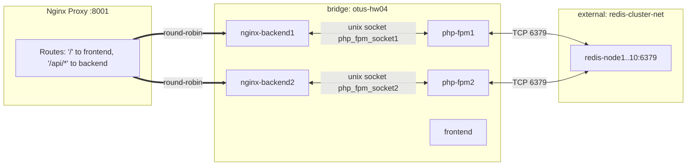

# 🧰 Infrastructure — Docker/Compose, окружение, сети и тома

Версия: 1.0  
Дата: 2025‑08‑14

Документ описывает инфраструктурную конфигурацию учебного мини‑проекта «Валидация скобок»: контейнеры, сети, переменные окружения, маппинги томов, режимы dev/prod и правила маршрутизации. Синхронизировано с: README.md, docs/overview/*, backend‑architecture.md, frontend‑architecture.md и фактическими docker‑файлами.

Смотри также:
- docker-compose.yml, docker-compose.dev.yml, docker-compose.prod.yml
- docker/* (Dockerfile’ы), nginx/* (конфиги Nginx)
- env/.env.dev(.example), env/.env.prod(.example)
- php/conf.d/session.redis.ini, config/redis.php

---

## 1) Обзор инфраструктуры

Сервисы (контейнеры):
- nginx-proxy — внешний балансировщик/маршрутизатор (порт 8001 → HTTP 80 внутри прокси)
- nginx-backend1, nginx-backend2 — два экземпляра Nginx перед PHP‑FPM, обслуживают статик и проксируют PHP на UNIX‑сокет
- php-fpm1, php-fpm2 — два экземпляра PHP 8.4 FPM приложения
- frontend — статически собранный Vue (prod) или Vite dev server (dev)
- Redis Cluster — внешний кластер (10 узлов) в отдельной сети Docker (external network)

Сети:
- otus-hw04 (bridge) — внутренняя сеть для proxy, backend и frontend
- redis-cluster-net (external) — внешняя сеть с заранее поднятым кластером Redis (узлы redis-node1..redis-node10)

Порты (снаружи):
- 8001/tcp — публичный входной порт (Nginx proxy)
- 5173/tcp — Vite dev server (только в dev)

Маршрутизация через proxy:
- / → статика фронтенда (frontend_upstream)
- /api/* → backend_upstream (round‑robin к nginx-backend1/2), префикс /api снимается (внутри приложения маршруты без /api)

---

## 2) Docker Compose: базовая оркестрация

Файл docker-compose.yml определяет состав сервисов и общую сеть:
- nginx-proxy
  - build: docker/proxy/proxy.Dockerfile
  - depends_on: nginx-backend1, nginx-backend2, frontend
  - ports: 8001:80
  - networks: otus-hw04
- nginx-backend1 / nginx-backend2
  - build: docker/backend/backend.Dockerfile
  - networks: otus-hw04
  - volumes: php_fpm_socket{1|2} → /var/run/php (разделение сокетов)
- php-fpm1 / php-fpm2
  - build: docker/php/php.Dockerfile
  - networks: otus-hw04, redis-cluster-net
  - volumes: php_fpm_socket{1|2} → /var/run/php (один сокет на инстанс)
- frontend
  - build: docker/frontend/vue.prod.Dockerfile
  - networks: otus-hw04

Сети и тома:
- networks:
  - otus-hw04: bridge (создаётся автоматически)
  - redis-cluster-net: external: true (должна существовать заранее)
- volumes:
  - php_fpm_socket1, php_fpm_socket2 — именованные тома для UNIX‑сокетов php-fpm.sock

Примечания:
- nginx/backend/conf.d/default.conf использует fastcgi_pass unix:/var/run/php/php-fpm.sock — поэтому для каждого backend контейнера подключён свой volume с сокетом конкретного php-fpm экземпляра.
- redis-cluster-net должен быть создан/доступен извне: в нём запущены redis-node1..redis-node10:6379.

---

## 3) Dev vs Prod: оверрайды

Dev (docker-compose.dev.yml):
- nginx-proxy, nginx-backend1/2, php-fpm1/2 используют dev‑образы (или build + image теги):
  - nginx-backend{1,2}: монтируются:
    - ./nginx/backend/conf.d → /etc/nginx/conf.d:ro
    - ./nginx/backend/nginx.conf → /etc/nginx/nginx.conf:ro
    - ./public → /app/public
  - php-fpm{1,2}:
    - env_file: env/.env.dev
    - volumes:
      - ./src → /app/src (горячая разработка PHP‑кода)
      - ./tests → /app/tests
      - ./scripts → /app/scripts
      - ./phpunit.xml → /app/phpunit.xml
      - ./coverage → /app/coverage (отчёты PCOV)
      - ./php/dev.php.ini → /usr/local/etc/php/conf.d/local.ini
    - environment: COMPOSER_HOME=/var/www/.composer
  - frontend (Vue):
    - docker/frontend/vue.dev.Dockerfile
    - volumes: ./frontend → /app; а также анонимный том /app/node_modules
    - ports: 5173:5173 (Vite dev server)

Prod (docker-compose.prod.yml):
- Используются опубликованные prod‑образы:
  - vlavlamat/nginx-proxy-hw04:prod
  - vlavlamat/nginx-backend-hw04:prod (x2)
  - vlavlamat/php-fpm-hw04:prod (x2)
  - vlavlamat/vue-frontend-hw04:prod
- env_file для php-fpm{1,2}: env/.env.prod
- restart: always для всех сервисов
- В prod режиме нет bind‑mount’ов исходников; статика фронтенда интегрирована в образ frontend (Nginx + /usr/share/nginx/html)

---

## 4) Dockerfile’ы и ключевые нюансы

- docker/proxy/proxy.Dockerfile
  - Базовый nginx:stable-alpine; удаляет default.conf; копирует nginx/proxy/default.conf
  - Секция upstream в nginx/proxy/default.conf определяет backend_upstream и frontend_upstream, включает keepalive 32 и round‑robin
  - Проксирование:
    - / → frontend_upstream
    - /api/ → backend_upstream/ (обратите внимание на слеш в конце — префикс /api обрезается)

- docker/backend/backend.Dockerfile
  - Базовый nginx:stable-alpine; добавляет пользователя в группу www-data
  - Копирует nginx.conf и conf.d/*.conf; копирует /app/public и /app/src (в prod при сборке)
  - В default.conf задано fastcgi_pass unix:/var/run/php/php-fpm.sock; буферы/таймауты настроены для стабильной работы

- docker/php/php.Dockerfile
  - Базовый php:8.4-fpm-alpine; pecl: redis, pcov; конфиги php-fpm и php.ini; Composer
  - ARG INSTALL_DEV контролирует установку dev‑зависимостей Composer (install vs update/no-dev)
  - Копирует src, public, config в /app; CMD ["php-fpm"]

- docker/frontend/vue.dev.Dockerfile
  - Node 22 alpine; npm install; копирует frontend; запускает `npm run dev -- --host` (Vite)

- docker/frontend/vue.prod.Dockerfile
  - Двухфазная сборка: builder (Node) → runtime (Nginx), копирование dist в /usr/share/nginx/html; собственный nginx конфиг nginx/frontend/default.conf

---

## 5) Переменные окружения

Источник: env/.env.dev, env/.env.prod; валидируются в App\Bootstrap\EnvironmentLoader.

Обязательные (REQUIRED_ENV_VARIABLES):
- REDIS_QUORUM — кворум мастеров (минимум доступных мастер‑узлов), по умолчанию 3
- REDIS_TIMEOUT — таймаут подключения к Redis (сек)
- REDIS_READ_TIMEOUT — таймаут чтения из Redis (сек)
- REDIS_CLUSTER_NODES — список нод через запятую: `redis-node1:6379,...,redis-node10:6379`
- REDIS_SESSION_PREFIX — префикс ключей сессий, напр. `otus_hw04:`
- REDIS_SESSION_LIFETIME — gc_maxlifetime для сессий, сек (dev 86400, prod 3600)
- REDIS_GC_PROBABILITY — вероятность запуска GC (числитель)
- REDIS_GC_DIVISOR — знаменатель вероятности GC
- REDIS_CHECK_INTERVAL — интервал проверки health (сек)
- REDIS_PING_TIMEOUT — таймаут ping узлов при health (сек)
- APP_ENV — `development | production`
- APP_DEBUG — `true | false`

Применение переменных:
- config/redis.php — читает все перечисленные параметры через getenv() и формирует конфигурацию приложения
- php/conf.d/session.redis.ini — фиксирует seed[]=redis-nodeX:6379 и prefix=otus_hw04: для PHP‑сессий (должно соответствовать REDIS_CLUSTER_NODES/REDIS_SESSION_PREFIX)

Загрузку env в контейнеры осуществляет docker-compose через `env_file` для php-fpm сервисов.

---

## 6) Сети и DNS‑имена контейнеров

- Внутренняя сеть otus-hw04 (bridge): контейнеры доступны по service‑name:
  - nginx-proxy → `nginx-proxy`
  - backend Nginx → `nginx-backend1`, `nginx-backend2`
  - php-fpm → `php-fpm1`, `php-fpm2`
  - frontend → `frontend`
- Внешняя сеть redis-cluster-net (external): доступ к узлам `redis-node1..redis-node10` на порту 6379 (имена должны существовать в этой сети заранее)

Важно:
- php-fpm1/2 включены одновременно в обе сети: `otus-hw04` (для взаимодействия с backend Nginx через UNIX‑сокет) и `redis-cluster-net` (для подключения к Redis)
- nginx-backend1/2 видят php-fpm через UNIX‑сокет, а не по TCP — поэтому нет отдельной сети связности между ними

---

## 7) Томá и маппинги (Volumes)

Именованные тома:
- php_fpm_socket1 → /var/run/php (монтируется в nginx-backend1 и php-fpm1)
- php_fpm_socket2 → /var/run/php (монтируется в nginx-backend2 и php-fpm2)

Назначение: разделить сокеты для каждого пула php-fpm и соответствующего backend Nginx, исключить кросс‑доступ и упростить отладку/балансировку.

Bind‑mount’ы (dev):
- nginx backend конфиги: ./nginx/backend/* → /etc/nginx/*:ro
- PHP исходники/тесты/скрипты: ./src, ./tests, ./scripts → /app/*
- phpunit.xml, coverage, dev.php.ini → соответствующие пути в контейнере
- frontend исходники: ./frontend → /app, а также анонимный том /app/node_modules

В prod bind‑mount’ов исходников нет, всё упаковано в образы.

---

## 8) Зависимости между сервисами

- nginx-proxy `depends_on`: nginx-backend1, nginx-backend2, frontend (обеспечивает упорядоченный старт)
- backend Nginx ↔ php-fpm: связь через UNIX‑сокет, общий именованный том
- php-fpm → Redis Cluster: TCP 6379 к узлам redis-nodeX в сети redis-cluster-net

Health‑чек:
- На уровне proxy — пассивные проверки (max_fails, fail_timeout) в upstream backend; keepalive 32 для эффективности
- Эндпоинт `/api/status` отображает доступность Redis Cluster на уровне приложения

---

## 9) Запуск и эксплуатация

Подготовка env:
```
cp env/.env.dev.example env/.env.dev
cp env/.env.prod.example env/.env.prod
```

Dev:
```
make dev-build   # сборка и запуск dev окружения
make dev-logs    # логи всех сервисов
make dev-down    # остановка и удаление контейнеров
```
Доступ:
- UI и API через прокси: http://localhost:8001
- Прямой доступ к Vite: http://localhost:5173 (для разработки UI)

Prod:
```
make prod-up     # запуск с prod образами и env/.env.prod
make prod-logs   # логи
make prod-down   # остановка
```

Проверки:
- API: `curl -s -X POST http://localhost:8001/api/validate -H 'Content-Type: application/json' -d '{"string":"()()"}'`
- Health: `curl -s http://localhost:8001/api/status`

Логи (через docker compose или Makefile):
- `make dev-logs` / `make prod-logs`

---

## 10) Безопасность и ограничения

- CORS обрабатывается на backend (GET, POST, OPTIONS; preflight 200). Прокси скрывает заголовки `Server`, `X-Powered-By`.
- Нет sticky‑sessions — хранение сессий в Redis делает backend stateless с точки зрения HTTP‑сеанса.
- HTTPS не настроен (учебный проект локального запуска); добавление TLS возможно на уровне nginx-proxy.
- Лимиты тела запроса и буферов настроены в nginx/backend/conf.d/default.conf.

---

## 11) Требования к внешнему Redis Cluster

- Docker network `redis-cluster-net` должна существовать и включать контейнеры:
  - `redis-node1..redis-node10` на 6379/tcp
- Переменные окружения REDIS_CLUSTER_NODES должны соответствовать реальным DNS‑именам/портам узлов кластера
- Префикс сессий (REDIS_SESSION_PREFIX) согласован с php/conf.d/session.redis.ini (`prefix=otus_hw04:`)

---

## 12) Диаграмма инфраструктуры



---

## 13) Соответствие документации и кода

- Этот документ согласован с:
  - nginx/proxy/default.conf (upstream, маршруты, таймауты, keepalive)
  - nginx/backend/* (fastcgi через unix‑сокет, буферы/таймауты)
  - docker‑compose.*.yml (состав сервисов, сети, тома)
  - php/conf.d/session.redis.ini (handler=rediscluster, seed[], prefix)
  - config/redis.php (env‑конфигурация Redis и мониторинга)
  - docs/overview/architecture.md, backend-architecture.md, frontend-architecture.md, data-flow.md, control-flow.md, api-spec.md

Документ отражает фактическую инфраструктуру текущего MVP и предназначен для разработчиков и студентов, запускающих проект локально или в условном prod‑режиме.
