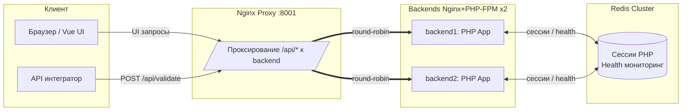

# Архитектура — High‑Level Overview

Версия: 1.0  
Дата: 2025‑08‑14

Цель документа — дать целостное представление о компонентах и взаимодействиях мини‑проекта «Валидация скобок». Важное: это учебный проект без БД, без аутентификации и без платёжных интеграций (Stripe вне scope).

## 1. Высокоуровневая схема

Ключевые идеи:
- Внешний трафик идёт на Nginx proxy (порт 8001). Все запросы к API — по префиксу `/api/*`.
- Прокси снимает префикс `/api` и раздаёт запросы двум backend‑инстансам (round‑robin upstream).
- Приложение — на PHP 8.4 (FPM) с собственным мини‑фреймворком (Router, Controllers, Services, Validator, Models).
- Сессии PHP хранятся в Redis Cluster; есть health‑проверка кластера на основе кворума.
- Frontend — Vue 3 + Vite: в dev режиме поднимается отдельный dev‑сервер; в prod сборка отдаётся через proxy.

## 2. Компоненты и ответственность

- Nginx Proxy (nginx/proxy):
  - Публикует внешний порт 8001, проксирует `/api/*` к backend, удаляет префикс `/api` при проксировании.
  - Балансирует между двумя backend (round‑robin). Без sticky‑sessions.
- Backend (nginx/backend + php-fpm):
  - PHP приложение (каталог `src/`): Router → Controllers → Services → Validator/Models.
  - Эндпоинты: `POST /validate`, `GET /status` (снаружи: `/api/validate`, `/api/status`).
  - CORS: GET, POST, OPTIONS; preflight отвечает 200 (см. `CorsMiddleware`).
  - Сессии: сохранение в Redis Cluster. Health-чек Redis через `RedisHealthChecker` и конфиг `config/redis.php`.
- Redis Cluster:
  - Хранение PHP‑сессий с использованием `session.save_handler = rediscluster`.
  - «Здоровье» определяется на основе числа доступных узлов и порога кворума; результат отражается в `GET /status`.
- Frontend (Vue 3 + Vite + Axios):
  - Мини‑UI для отправки строки валидации на `/api/validate` и показа статуса.
  - В dev окружении — отдельный Vite dev server (порт 5173). В prod — собранный фронтенд за Nginx proxy.

Примечание: Базы данных (PostgreSQL/MySQL) и платёжные интеграции (Stripe) отсутствуют и не требуются для данного проекта.

## 3. Точки входа и маршруты

Публичные через прокси:
- POST `/api/validate` → внутренний маршрут `POST /validate`
- GET `/api/status` → внутренний маршрут `GET /status`

CORS:
- Разрешены методы: GET, POST, OPTIONS; заголовки: `Content-Type`, `Authorization`.
- Preflight (OPTIONS) на `/api/*` возвращает 200 с корректными заголовками.

## 4. Технологический стек (именно здесь)

- Язык/Runtime: PHP 8.4 (FPM), строгие типы, PSR‑4 автозагрузка (Composer).
- Веб‑серверы: Nginx (proxy и backend‑слой перед PHP‑FPM).
- Хранилище: Redis Cluster (сессии, health мониторинг).
- Frontend: Vue 3 + Vite + Axios.
- Контейнеризация: Docker / Docker Compose.
- Тестирование: PHPUnit, PCOV (сбор покрытия в dev), команды в Makefile.

## 5. Сетевые порты и окружения

- Порты:
  - 8001 — внешний порт Nginx proxy (UI и API).
  - 5173 — Vite dev server (только dev режим, прямой доступ к фронтенду).
  - 6379.. — узлы Redis Cluster во внутренней сети Docker.
- Окружения:
  - Dev: `make dev-build` поднимает proxy, 2 backend, Redis Cluster, Vite dev server.
  - Prod: `make prod-up` — сборки образов, proxy + backend + Redis; фронтенд — собранный артефакт.
  - Переменные окружения — в `env/.env.dev` и `env/.env.prod` (см. примеры).

## 6. Потоки данных (high‑level)

- UI/Integrator → Proxy `/api/*` → Backend `/validate` или `/status` → Redis (сессии/health) → ответ клиенту.
- Валидация:
  - FormatValidator: trim, пустота, допустимые символы `(` и `)`, длина ≤ 30.
  - BracketValidator: односканерный баланс, статус `valid` / `invalid`.

## 7. Безопасность и ограничения

- Базовый CORS, строгая валидация входных данных, предсказуемые JSON‑ошибки на неверный запрос.
- HTTPS/аутентификация/авторизация — вне scope (демонстрационный проект локального запуска).
- Отсутствуют sticky‑sessions; балансировка — round‑robin на уровне Nginx.

## 8. Диагностика и тесты

- Health: `GET /api/status` показывает `connected`/`disconnected` для Redis Cluster.
- Логи контейнеров через `make dev-logs`/`make prod-logs`.
- Тесты: `make test`, `make test-coverage` (HTML отчёт в `./coverage`).

## 9. Сопутствующие документы

- README.md — запуск, структура, стек, примеры API.
- docs/overview/project-context.md — цели, аудитория, ограничения, архитектура верхнего уровня.
- docs/overview/requirements.md — требования и DoD.
- docs/overview/user-flow.md — пользовательские сценарии и диаграммы.
