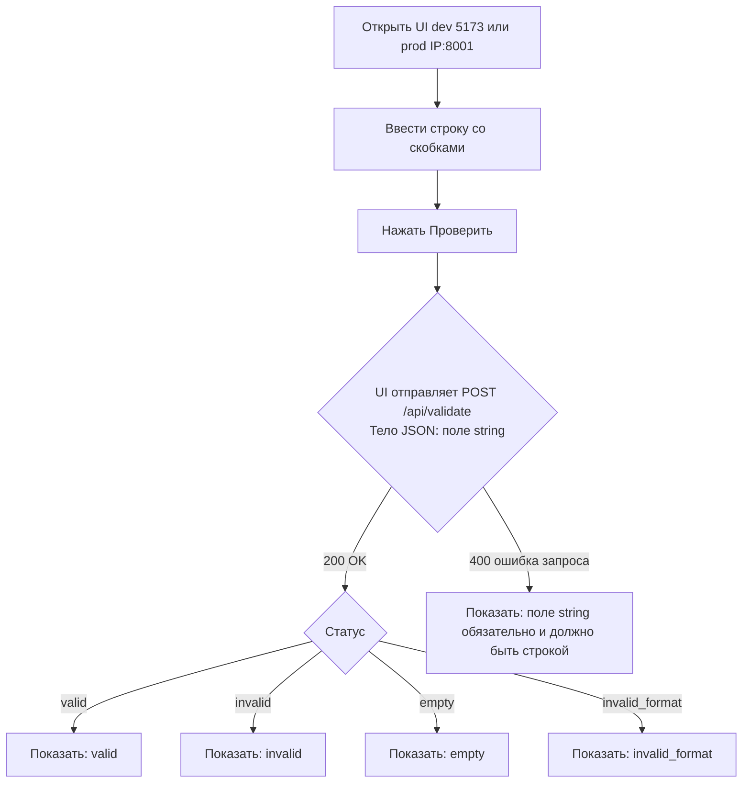
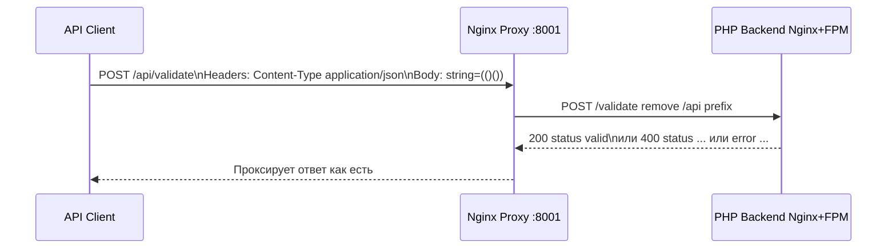
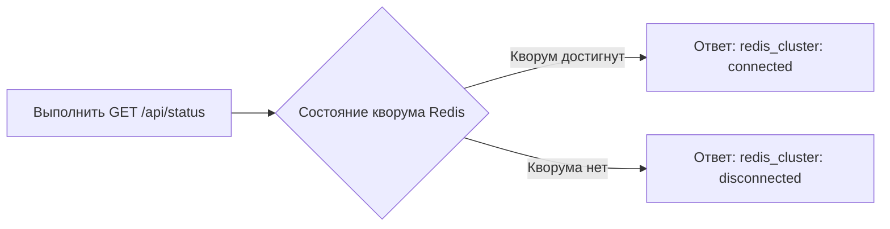
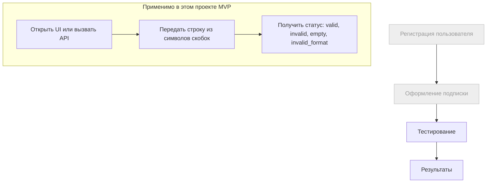

# User Flow — Основные сценарии пользователя (MVP)

Версия: 1.0  
Дата: 2025-08-14

Документ описывает пользовательские сценарии именно этого учебного мини‑проекта. Основано на README.md, project-context.md и requirements.md.

Важно: шаги «регистрация» и «подписка/оплата» в рамках данного проекта находятся вне области (out of scope). В текущем MVP нет учётных записей и биллинга. Основные сценарии — проверка строки через веб‑интерфейс или публичный API, а также операторская проверка статуса Redis Cluster.

## 1) Веб‑пользователь: Проверка строки со скобками (Vue UI → API)

Кратко: пользователь открывает фронтенд Vue, вводит строку и получает статус: valid | invalid | empty | invalid_format. Звонки к API идут через Nginx proxy по пути /api/*, внутри бэкенда без префикса.

Доступ к UI:
- dev: http://localhost:5173 (Vite dev server)
- prod: http://IP:8001 (через nginx-proxy; всё приложение работает в контейнерах)

Эндпоинты: 
- POST /api/validate (внутренний маршрут POST /validate)

Диаграмма (flowchart):

Пограничные случаи:
- Пустая строка после trim → empty.
- Недопустимые символы или длина больше 30 → invalid_format.
- Несбалансированные скобки → invalid.

## 2) Интегратор API: Прямой вызов публичного эндпоинта через прокси

Кратко: внешнее приложение шлёт запрос через Nginx proxy на /api/validate. CORS разрешает GET, POST, OPTIONS; для POST требуется Content-Type: application/json.

Эндпоинты:
- POST /api/validate

Диаграмма (sequence):

Ошибки запросов 400: отсутствует поле string или неверный тип.

## 3) Оператор/Разработчик: Проверка доступности Redis Cluster

Кратко: оператор проверяет статус кластера Redis, который хранит PHP‑сессии. Приложение продолжит работать при disconnected, но сессии будут недоступны или нестабильны.

Эндпоинты:
- GET /api/status (внутренний маршрут GET /status)

Диаграмма (flowchart):

Примечания:
- Health определяется числом доступных узлов и порогом кворума см. RedisHealthChecker.
- Логи и статус помогают диагностировать окружение dev и prod.

## 4) Сопоставление с типичным продуктовым флоу регистрация → подписка → тестирование → результаты

Для ясности: первые два шага не применимы к данному мини‑проекту. Ниже — иллюстрация, где отмечены вне scope шаги, а также показан фактический MVP‑путь.

Диаграмма (flowchart):

Расшифровка:
- Регистрация и подписка — вне scope, нет аккаунтов и биллинга.
- Тестирование и Результаты — реализованы как проверка строки через API с отображением статуса.

## 5) Точки интеграции и маршрутизация

- Все внешние запросы идут через Nginx proxy по префиксу /api, который удаляется при проксировании. Во внутреннем приложении маршруты без /api.
- CORS: GET, POST, OPTIONS; заголовки Content-Type, Authorization. Preflight OPTIONS возвращает 200.
- Статусы валидации: valid | invalid | empty | invalid_format. Ошибка запроса — JSON с ключом error.message.

## 6) Ссылки

- README.md — запуск, структура, стек, API примеры.
- docs/overview/project-context.md — миссия, цели, ограничения, архитектура верхнего уровня.
- docs/overview/requirements.md — пользовательские истории, требования и DoD.
